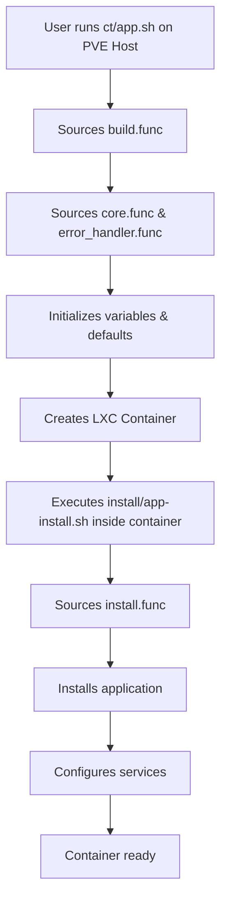

Proxmox VE Helper Scripts follows a modular architecture designed for maintainability, security, and ease of use. The system is built around reusable function libraries that power hundreds of application scripts.

## System Components

The architecture consists of three primary layers:

<CardGroup cols={3}>
  <Card title="Host Scripts" icon="server">
    Scripts executed on Proxmox VE host for container/VM creation
  </Card>
  <Card title="Function Libraries" icon="layer-group">
    Shared utilities providing core functionality
  </Card>
  <Card title="Install Scripts" icon="download">
    Application-specific setup running inside containers
  </Card>
</CardGroup>

## Architecture Diagram



## Function Libraries

The system relies on several specialized function libraries:

### Core Libraries (Sourced from GitHub)

<Accordion title="build.func - Container Build & Configuration">
The primary library for LXC container creation. Located at `misc/build.func`, it provides:

- **Variable initialization** (`variables()`) - Normalizes app names, generates session IDs
- **Storage management** - Handles storage selection for containers and templates
- **Configuration system** - Loads user defaults from `.vars` files
- **Container creation** (`build_container()`) - Orchestrates the entire build process
- **Resource allocation** - CPU, RAM, disk configuration with precedence logic

```bash
# Key sections in build.func
SOURCE: https://raw.githubusercontent.com/.../misc/build.func

1. Initialization & Core Variables
2. Pre-flight Checks & System Validation  
3. Container Setup Utilities
4. Storage & Resource Management
5. Configuration & Defaults Management
6. Build Process Orchestration
```
</Accordion>

<Accordion title="install.func - In-Container Installation">
Executes inside containers after creation. Located at `misc/install.func`, it handles:

- **Network connectivity** verification (IPv4/IPv6)
- **OS updates** - `update_os()` refreshes package lists
- **DNS resolution** checks
- **MOTD configuration** - Sets up message of the day
- **SSH setup** - Configures SSH access if enabled
- **Service configuration** - Post-installation setup

```bash
# Typical install.func workflow
source /dev/stdin <<<"$FUNCTIONS_FILE_PATH"
color
verb_ip6
catch_errors
setting_up_container
network_check
update_os
```
</Accordion>

<Accordion title="core.func - Shared Utilities">
Provides common functions used across all scripts:

- Message formatting (`msg_info`, `msg_ok`, `msg_error`, `msg_warn`)
- Color definitions and UI helpers
- GitHub release fetching (`get_latest_github_release`)
- Service setup functions (PHP, MariaDB, Composer, etc.)
- Network utilities

</Accordion>

<Accordion title="api.func - API Integration & Telemetry">
Handles communication with external services:

- Telemetry reporting (with user consent)
- Update checks
- Session tracking
- Progress reporting

</Accordion>

<Accordion title="error_handler.func - Error Management">
Provides robust error handling:

- Trap handlers for script failures
- Cleanup on exit
- Detailed error reporting
- Log management

</Accordion>

## Data Flow

### Container Creation Flow

```
┌─────────────────────────────────────────────────────────────┐
│                  User Executes ct/2fauth.sh                 │
│  bash -c "$(wget -qLO - https://github.com/.../ct/2fauth)" │
└────────────────────┬────────────────────────────────────────┘
                     │
                     v
┌─────────────────────────────────────────────────────────────┐
│  Source build.func from GitHub                              │
│  source <(curl -fsSL .../misc/build.func)                  │
└────────────────────┬────────────────────────────────────────┘
                     │
                     v
┌─────────────────────────────────────────────────────────────┐
│  build.func sources dependencies:                           │
│  - api.func (API communication)                             │
│  - core.func (utilities)                                    │
│  - error_handler.func (error management)                    │
└────────────────────┬────────────────────────────────────────┘
                     │
                     v
┌─────────────────────────────────────────────────────────────┐
│  Initialize Variables                                        │
│  - APP="2FAuth"                                             │
│  - NSAPP="2fauth" (normalized)                              │
│  - var_install="2fauth-install"                            │
│  - Set resource defaults (CPU, RAM, disk)                   │
└────────────────────┬────────────────────────────────────────┘
                     │
                     v
┌─────────────────────────────────────────────────────────────┐
│  Load Configuration                                          │
│  1. Check environment variables (var_cpu, var_ram, etc.)    │
│  2. Load app defaults: /defaults/2fauth.vars (if exists)    │
│  3. Load user defaults: /default.vars (if exists)           │
│  4. Apply built-in defaults (fallback)                      │
└────────────────────┬────────────────────────────────────────┘
                     │
                     v
┌─────────────────────────────────────────────────────────────┐
│  User Interaction                                            │
│  - Display installation mode menu                           │
│  - Options: Default, Advanced, App Defaults, etc.           │
│  - Collect storage selection                                │
└────────────────────┬────────────────────────────────────────┘
                     │
                     v
┌─────────────────────────────────────────────────────────────┐
│  Create LXC Container                                        │
│  pct create <CTID> <template> \                             │
│    --cores <CPU> --memory <RAM> --rootfs <storage>:<size>   │
└────────────────────┬────────────────────────────────────────┘
                     │
                     v
┌─────────────────────────────────────────────────────────────┐
│  Start Container                                             │
│  pct start <CTID>                                           │
└────────────────────┬────────────────────────────────────────┘
                     │
                     v
┌─────────────────────────────────────────────────────────────┐
│  Execute Install Script Inside Container                     │
│  pct push <CTID> install/2fauth-install.sh                  │
│  pct exec <CTID> -- bash /tmp/install.sh                    │
└────────────────────┬────────────────────────────────────────┘
                     │
                     v
┌─────────────────────────────────────────────────────────────┐
│  Install Script Sources install.func                         │
│  - Verifies network connectivity                             │
│  - Updates OS packages                                       │
│  - Installs application dependencies                         │
│  - Configures services                                       │
└────────────────────┬────────────────────────────────────────┘
                     │
                     v
┌─────────────────────────────────────────────────────────────┐
│  Application Ready                                           │
│  Display access URL and completion message                   │
└─────────────────────────────────────────────────────────────┘
```

## Variable Precedence System

Configuration values follow a strict precedence order:

<Steps>
  <Step title="Environment Variables (Highest Priority)">
    Variables set in the shell environment before running the script:
    ```bash
    export var_cpu=8
    export var_ram=4096
    bash -c "$(wget -qLO - ...)"
    ```
  </Step>
  
  <Step title="App-Specific Defaults">
    Stored in `/usr/local/community-scripts/defaults/<app>.vars`:
    ```bash
    var_cpu=2
    var_ram=1024
    var_disk=10
    ```
  </Step>
  
  <Step title="User Global Defaults">
    Stored in `/usr/local/community-scripts/default.vars`:
    ```bash
    var_cpu=4
    var_ram=2048
    var_brg=vmbr0
    ```
  </Step>
  
  <Step title="Built-in Defaults (Lowest Priority)">
    Hardcoded in the app script:
    ```bash
    var_cpu="${var_cpu:-1}"
    var_ram="${var_ram:-512}"
    ```
  </Step>
</Steps>

<Info>
For resource allocation (CPU, RAM, disk), if the **app script declares higher values** than user defaults, the app values take precedence. This ensures applications get the resources they need to run properly.
</Info>

## Security Model

The architecture implements multiple security layers:

### Safe Configuration Parsing

<Warning>
The system **never uses `source` or `eval`** on configuration files to prevent arbitrary code execution.
</Warning>

Instead, `load_vars_file()` implements safe parsing:

```bash
# ❌ DANGEROUS (NOT USED)
source /path/to/config.conf  # Could execute malicious code

# ✅ SAFE (ACTUAL IMPLEMENTATION)
load_vars_file "/path/to/config.conf"  # Only reads key=value pairs
```

### Input Validation

1. **Whitelist validation** - Only approved variable names accepted
2. **Value sanitization** - Blocks command injection patterns:
   - `$(command)` - Command substitution
   - `` `command` `` - Backtick execution  
   - `;` - Command chaining
   - `&` - Background execution
   - `<(...)` - Process substitution

3. **Type validation** - Numeric values validated against regex patterns

### Secure Defaults

- Containers run **unprivileged by default** (`var_unprivileged=1`)
- Limited resource allocation prevents resource exhaustion
- SSH access requires explicit user consent
- Firewall features available for network isolation

## Extension Points

Developers can extend the system through:

### Custom Function Libraries

Specialized libraries for specific scenarios:
- `alpine-install.func` - Alpine Linux support
- `alpine-tools.func` - Alpine-specific utilities
- `cloud-init.func` - Cloud-init integration for VMs
- `vm-core.func` - Virtual machine creation

### Update Scripts

Every app script includes an `update_script()` function:

```bash
function update_script() {
  header_info
  check_container_storage
  check_container_resources
  
  # Application-specific update logic
  if check_for_gh_release "2fauth" "Bubka/2FAuth"; then
    $STD apt update
    $STD apt -y upgrade
    # ... update application
  fi
}
```

This function is called when users run the update command on an existing container.

## Logging and Diagnostics

The architecture includes comprehensive logging:

- **Build logs**: `/tmp/create-lxc-${SESSION_ID}.log` (on host)
- **Combined logs**: `/tmp/${NSAPP}-${CTID}-${SESSION_ID}.log`
- **Persistent logs**: `/var/log/community-scripts/` (when DEV_MODE_LOGS enabled)
- **Session tracking**: Unique session IDs for troubleshooting

<Tip>
Enable verbose logging by setting `var_verbose=yes` or using the diagnostic mode menu option.
</Tip>

## Resource Management

The system intelligently manages storage and resources:

### Storage Selection

1. **Auto-detection**: If only one storage exists, auto-select it
2. **Validation**: Checks available space before allocation
3. **Separation**: Container and template storage can differ
4. **User control**: Advanced mode allows manual selection

### Resource Allocation Logic

```bash
# Example from build.func:883-914
base_settings() {
  local final_disk="${var_disk:-4}"
  local final_cpu="${var_cpu:-1}"
  local final_ram="${var_ram:-1024}"
  
  # If app declared higher values, use those instead
  if [[ -n "${APP_DEFAULT_DISK:-}" && "${APP_DEFAULT_DISK}" =~ ^[0-9]+$ ]]; then
    if [[ "${APP_DEFAULT_DISK}" -gt "${final_disk}" ]]; then
      final_disk="${APP_DEFAULT_DISK}"
    fi
  fi
  
  DISK_SIZE="${final_disk}"
  CORE_COUNT="${final_cpu}"
  RAM_SIZE="${final_ram}"
}
```

This ensures applications always get sufficient resources while respecting user preferences.

## Next Steps

<CardGroup cols={2}>
  <Card title="Containers vs VMs" icon="layer-group" href="/concepts/containers-vs-vms">
    Learn the differences between LXC containers and virtual machines
  </Card>
  <Card title="Script Structure" icon="code" href="/concepts/script-structure">
    Deep dive into how scripts are organized and executed
  </Card>
</CardGroup>