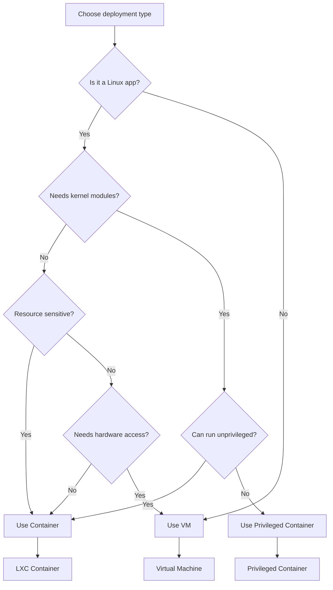

Proxmox VE Helper Scripts supports both **LXC containers** (lightweight) and **Virtual Machines** (full isolation). Understanding when to use each is crucial for optimal performance and security.

## Quick Comparison

| Feature | LXC Containers | Virtual Machines |
|---------|---------------|------------------|
| **Overhead** | Minimal (shares host kernel) | Higher (full OS) |
| **Boot Time** | Seconds | Minutes |
| **Resource Usage** | Very efficient | More resources |
| **Isolation** | Process-level | Hardware-level |
| **OS Support** | Linux only | Any OS |
| **Performance** | Near-native | Slight overhead |
| **Security** | Good (with unprivileged) | Excellent |
| **Use Case** | Linux apps, services | Non-Linux OS, full isolation |

## LXC Containers

### What Are LXC Containers?

LXC (Linux Containers) are **OS-level virtualization** that share the host kernel while providing isolated user spaces. They're similar to Docker containers but designed for running full system services.

<Info>
Think of containers as **lightweight isolated environments** that share the same kernel but have their own filesystem, processes, and network stack.
</Info>

### Container Architecture

```
┌─────────────────────────────────────────────────────────┐
│                    Proxmox VE Host                      │
│                   (Linux Kernel 6.x)                    │
├─────────────────────────────────────────────────────────┤
│  ┌──────────────┐  ┌──────────────┐  ┌──────────────┐  │
│  │ Container 1  │  │ Container 2  │  │ Container 3  │  │
│  │              │  │              │  │              │  │
│  │ 2FAuth       │  │ Docker       │  │ Pi-hole      │  │
│  │ (Debian 13)  │  │ (Debian 13)  │  │ (Debian 13)  │  │
│  │              │  │              │  │              │  │
│  │ User: 100000 │  │ User: 100000 │  │ User: 100000 │  │
│  │ Unprivileged │  │ Unprivileged │  │ Unprivileged │  │
│  └──────────────┘  └──────────────┘  └──────────────┘  │
│                                                         │
│  Shared: Kernel, Drivers, Core Libraries               │
└─────────────────────────────────────────────────────────┘
```

### Container Scripts Structure

All container scripts follow a consistent two-file pattern:

#### 1. Host Script (ct/*.sh)

Executes on the **Proxmox VE host** to create the container.

<CodeGroup>
```bash ct/2fauth.sh
#!/usr/bin/env bash
source <(curl -fsSL https://raw.githubusercontent.com/community-scripts/ProxmoxVE/main/misc/build.func)

APP="2FAuth"
var_tags="${var_tags:-2fa;authenticator}"
var_cpu="${var_cpu:-1}"
var_ram="${var_ram:-512}"
var_disk="${var_disk:-2}"
var_os="${var_os:-debian}"
var_version="${var_version:-13}"
var_unprivileged="${var_unprivileged:-1}"

header_info "$APP"
variables
color
catch_errors

function update_script() {
  # Update logic for existing containers
  header_info
  check_container_storage
  check_container_resources
  # ... update application
}

start
build_container  # Creates LXC container
description

msg_ok "Completed successfully!\n"
echo -e "${CREATING}${GN}${APP} setup has been successfully initialized!${CL}"
echo -e "${INFO}${YW} Access it using the following URL:${CL}"
echo -e "${TAB}${GATEWAY}${BGN}http://${IP}:80${CL}"
```

```bash ct/docker.sh
#!/usr/bin/env bash
source <(curl -fsSL https://raw.githubusercontent.com/community-scripts/ProxmoxVE/main/misc/build.func)

APP="Docker"
var_tags="${var_tags:-docker}"
var_cpu="${var_cpu:-2}"        # Higher resources needed
var_ram="${var_ram:-2048}"     # 2GB RAM
var_disk="${var_disk:-4}"      # 4GB disk
var_os="${var_os:-debian}"
var_version="${var_version:-13}"
var_unprivileged="${var_unprivileged:-1}"

header_info "$APP"
variables
color
catch_errors

function update_script() {
  header_info
  check_container_storage
  check_container_resources
  
  msg_info "Updating Docker Engine"
  $STD apt install --only-upgrade -y docker-ce docker-ce-cli containerd.io
  msg_ok "Docker Engine updated"
}

start
build_container
description
```
</CodeGroup>

<Accordion title="Key Elements in Host Scripts">
- **APP**: Human-readable application name
- **var_tags**: Categorization tags (used for filtering)
- **var_cpu/ram/disk**: Resource allocation (defaults)
- **var_os**: Operating system (debian, ubuntu, alpine)
- **var_version**: OS version number
- **var_unprivileged**: Security mode (1=unprivileged, 0=privileged)
- **update_script()**: Function called when updating existing containers
- **build_container**: Main function that orchestrates container creation
</Accordion>

#### 2. Install Script (install/*-install.sh)

Executes **inside the container** after creation to install the application.

<CodeGroup>
```bash install/2fauth-install.sh
#!/usr/bin/env bash

source /dev/stdin <<<"$FUNCTIONS_FILE_PATH"
color
verb_ip6
catch_errors
setting_up_container
network_check
update_os

msg_info "Installing Dependencies"
$STD apt install -y nginx
msg_ok "Installed Dependencies"

export PHP_VERSION="8.4"
PHP_FPM="YES" setup_php
setup_composer
setup_mariadb
MARIADB_DB_NAME="2fauth_db" MARIADB_DB_USER="2fauth" setup_mariadb_db

fetch_and_deploy_gh_release "2fauth" "Bubka/2FAuth" "tarball"

msg_info "Setup 2FAuth"
cd /opt/2fauth
cp .env.example .env
sed -i -e "s|^APP_URL=.*|APP_URL=http://$LOCAL_IP|" \
  -e "s|^DB_CONNECTION=$|DB_CONNECTION=mysql|" \
  -e "s|^DB_DATABASE=$|DB_DATABASE=$MARIADB_DB_NAME|" .env
export COMPOSER_ALLOW_SUPERUSER=1
$STD composer install --no-dev --prefer-dist
$STD php artisan key:generate --force
$STD php artisan migrate:refresh
chown -R www-data: /opt/2fauth
msg_ok "Setup 2fauth"

msg_info "Configure Service"
cat <<EOF >/etc/nginx/conf.d/2fauth.conf
server {
    listen 80;
    root /opt/2fauth/public;
    server_name $LOCAL_IP;
    index index.php;
    
    location / {
        try_files \$uri \$uri/ /index.php?\$query_string;
    }
    
    location ~ \.php\$ {
        fastcgi_pass unix:/var/run/php/php${PHP_VERSION}-fpm.sock;
        fastcgi_param SCRIPT_FILENAME \$realpath_root\$fastcgi_script_name;
        include fastcgi_params;
    }
}
EOF
systemctl reload nginx
msg_ok "Configured Service"

motd_ssh
customize
cleanup_lxc
```

```bash install/docker-install.sh
#!/usr/bin/env bash

source /dev/stdin <<<"$FUNCTIONS_FILE_PATH"
color
verb_ip6
catch_errors
setting_up_container
network_check
update_os

DOCKER_LATEST_VERSION=$(get_latest_github_release "moby/moby")

msg_info "Installing Docker $DOCKER_LATEST_VERSION (with Compose, Buildx)"
DOCKER_CONFIG_PATH='/etc/docker/daemon.json'
mkdir -p $(dirname $DOCKER_CONFIG_PATH)
echo -e '{\n  "log-driver": "journald"\n}' >/etc/docker/daemon.json
$STD sh <(curl -fsSL https://get.docker.com)
msg_ok "Installed Docker $DOCKER_LATEST_VERSION"

read -r -p "${TAB3}Would you like to add Portainer (UI)? <y/N> " prompt
if [[ ${prompt,,} =~ ^(y|yes)$ ]]; then
  msg_info "Installing Portainer"
  docker volume create portainer_data >/dev/null
  $STD docker run -d \
    -p 8000:8000 \
    -p 9443:9443 \
    --name=portainer \
    --restart=always \
    -v /var/run/docker.sock:/var/run/docker.sock \
    -v portainer_data:/data \
    portainer/portainer-ce:latest
  msg_ok "Installed Portainer"
fi

motd_ssh
customize
cleanup_lxc
```
</CodeGroup>

<Accordion title="Key Elements in Install Scripts">
- **source /dev/stdin**: Loads install.func from FUNCTIONS_FILE_PATH
- **setting_up_container**: Initializes container environment
- **network_check**: Verifies internet connectivity
- **update_os**: Updates package lists and base system
- **setup_php/setup_mariadb/setup_composer**: Helper functions from core.func
- **fetch_and_deploy_gh_release**: Downloads latest release from GitHub
- **motd_ssh**: Configures message of the day
- **customize**: Applies user customizations
- **cleanup_lxc**: Final cleanup steps
</Accordion>

### Privileged vs Unprivileged Containers

<Tabs>
  <Tab title="Unprivileged (Recommended)">
    **Default mode** for all scripts (`var_unprivileged=1`)
    
    - User ID mapping: Container root (UID 0) maps to host UID 100000
    - Better security isolation
    - Cannot directly access host devices
    - Recommended for most applications
    
    ```bash
    # Inside container
    root@container:~# id
    uid=0(root) gid=0(root)
    
    # On host (same process)
    root@pve:~# ps aux | grep nginx
    100000   1234  nginx: master process
    ```
  </Tab>
  
  <Tab title="Privileged (Legacy)">
    **Legacy mode** (`var_unprivileged=0`)
    
    - Container root = Host root (UID 0)
    - Full hardware access
    - Required for some specialized applications
    - **Security risk** - container escape affects host
    
    <Warning>
    Only use privileged containers when absolutely necessary (e.g., Docker with device passthrough, GPU access).
    </Warning>
  </Tab>
</Tabs>

### When to Use Containers

<Check>Use LXC containers for:</Check>

- **Linux applications** (Debian, Ubuntu, Alpine based)
- **Web services** (nginx, Apache, databases)
- **Docker hosts** (running Docker inside LXC)
- **Network services** (Pi-hole, DNS, VPN)
- **Development environments**
- **Microservices** that need fast startup
- **Resource-constrained scenarios**

## Virtual Machines

### What Are VMs?

Virtual Machines provide **full hardware virtualization** with complete OS isolation. Each VM runs its own kernel and can run any operating system.

### VM Architecture

```
┌─────────────────────────────────────────────────────────┐
│                    Proxmox VE Host                      │
│                   (Linux Kernel 6.x)                    │
├─────────────────────────────────────────────────────────┤
│               KVM/QEMU Hypervisor Layer                 │
├─────────────────────────────────────────────────────────┤
│  ┌──────────────┐  ┌──────────────┐  ┌──────────────┐  │
│  │     VM 1     │  │     VM 2     │  │     VM 3     │  │
│  │              │  │              │  │              │  │
│  │ Home Assist. │  │  OPNsense    │  │  Windows 11  │  │
│  │ (HassOS)     │  │  (FreeBSD)   │  │  (Windows)   │  │
│  │              │  │              │  │              │  │
│  │ Own Kernel   │  │ Own Kernel   │  │ Own Kernel   │  │
│  │ Full Drivers │  │ Full Drivers │  │ Full Drivers │  │
│  └──────────────┘  └──────────────┘  └──────────────┘  │
│                                                         │
│  Isolated: Each VM has complete OS stack               │
└─────────────────────────────────────────────────────────┘
```

### VM Scripts Structure

VM scripts differ from container scripts as they handle full OS installation:

<CodeGroup>
```bash vm/haos-vm.sh (excerpt)
#!/usr/bin/env bash

source /dev/stdin <<<$(curl -fsSL https://raw.githubusercontent.com/.../misc/api.func)

GEN_MAC=02:$(openssl rand -hex 5 | awk '{print toupper($0)}' | sed 's/\(..\)/\1:/g; s/.$//')
RANDOM_UUID="$(cat /proc/sys/kernel/random/uuid)"
VERSIONS=(stable beta dev)
METHOD=""
NSAPP="homeassistant-os"
var_os="homeassistant"
DISK_SIZE="32G"

# Fetch available versions
for version in "${VERSIONS[@]}"; do
  eval "$version=$(curl -fsSL https://raw.githubusercontent.com/home-assistant/version/master/stable.json | grep '"ova"' | cut -d '"' -f 4)"
done

# VM creation logic
function get_valid_nextid() {
  local try_id
  try_id=$(pvesh get /cluster/nextid)
  while true; do
    if [ -f "/etc/pve/qemu-server/${try_id}.conf" ] || [ -f "/etc/pve/lxc/${try_id}.conf" ]; then
      try_id=$((try_id + 1))
      continue
    fi
    break
  done
  echo "$try_id"
}

# Download and import disk image
# Configure VM settings
# Start VM
```

```bash vm/opnsense-vm.sh (excerpt)
#!/usr/bin/env bash

# OPNsense VM creation
# Downloads FreeBSD-based image
# Configures network interfaces
# Sets up virtio drivers
```
</CodeGroup>

<Note>
VM scripts do **not use install scripts** because they boot complete OS images (OVA, QCOW2, ISO). Configuration happens through cloud-init or first-boot scripts.
</Note>

### When to Use VMs

<Check>Use Virtual Machines for:</Check>

- **Non-Linux operating systems** (Windows, FreeBSD, pfSense)
- **Home Assistant OS** (requires full OS control)
- **OPNsense/pfSense** (firewall appliances)
- **Maximum security isolation**
- **Kernel-level requirements**
- **Hardware passthrough** (GPU, USB devices)
- **Testing different kernels**
- **Legacy applications** requiring specific OS versions

## Decision Matrix

Use this flowchart to choose between containers and VMs:



## Performance Comparison

### Real-World Examples

<CardGroup cols={2}>
  <Card title="Pi-hole (Container)" icon="shield">
    - **Boot time**: 3-5 seconds
    - **Memory**: 100MB active
    - **CPU overhead**: Less than 1%
    - **Disk I/O**: Near-native
  </Card>
  
  <Card title="OPNsense (VM)" icon="firewall">
    - **Boot time**: 30-60 seconds
    - **Memory**: 1GB minimum
    - **CPU overhead**: 2-5%
    - **Disk I/O**: Slight overhead
  </Card>
</CardGroup>

### Benchmark Summary

| Operation | Container | VM |
|-----------|-----------|----|
| **Create** | 20-40 seconds | 2-5 minutes |
| **Start** | 2-5 seconds | 30-90 seconds |
| **Stop** | Instant | 10-30 seconds |
| **Backup** | Fast (rsync) | Slower (full disk) |
| **Restore** | Fast | Slower |
| **Snapshot** | Instant | Quick (storage dependent) |

## Migration Considerations

### Container to VM

If you need to migrate from container to VM:

<Steps>
  <Step title="Backup application data">
    Export databases, configuration files, and user data
  </Step>
  
  <Step title="Create VM with appropriate OS">
    Use vm/debian-vm.sh or similar
  </Step>
  
  <Step title="Restore application data">
    Install application manually or use install script as reference
  </Step>
</Steps>

### VM to Container

Downgrading from VM to container:

<Warning>
Only possible for Linux VMs. Windows/FreeBSD VMs cannot become containers.
</Warning>

<Steps>
  <Step title="Verify application compatibility">
    Check if app can run in unprivileged container
  </Step>
  
  <Step title="Export data">
    Backup all application data and configs
  </Step>
  
  <Step title="Create container">
    Use appropriate ct/ script
  </Step>
  
  <Step title="Restore data">
    Import data into new container
  </Step>
</Steps>

## Best Practices

<AccordionGroup>
  <Accordion title="Container Best Practices">
    - Always use **unprivileged mode** unless absolutely required
    - Allocate only **necessary resources** (easy to increase later)
    - Use **bind mounts** for data persistence
    - Enable **nesting** for Docker-in-LXC
    - Configure **backups** regularly
    - Monitor **resource usage** with pct commands
  </Accordion>
  
  <Accordion title="VM Best Practices">
    - Enable **VirtIO drivers** for better performance
    - Use **cloud-init** for automated configuration
    - Allocate **adequate disk space** (harder to resize)
    - Enable **QEMU guest agent**
    - Use **thin provisioning** when possible
    - Configure **NUMA** for multi-socket systems
  </Accordion>
</AccordionGroup>

## Next Steps

<CardGroup cols={2}>
  <Card title="Script Structure" icon="code" href="/concepts/script-structure">
    Learn how scripts are organized internally
  </Card>
  <Card title="Architecture" icon="sitemap" href="/concepts/architecture">
    Understand the overall system design
  </Card>
</CardGroup>