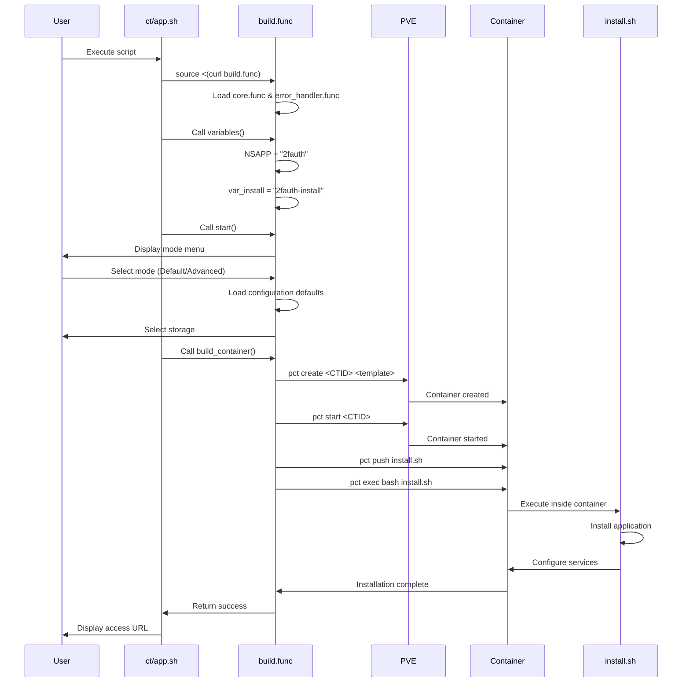

Every script in the Proxmox VE Helper Scripts project follows consistent patterns for maintainability and reliability. Understanding these patterns helps you customize scripts or troubleshoot issues.

## Container Script Anatomy

Let's examine a complete container script structure using real examples from the codebase.

### Host Script (ct/*.sh)

The script that runs on your Proxmox VE host to create containers.

<CodeGroup>
```bash Structure Overview
#!/usr/bin/env bash
# 1. HEADER: Shebang and metadata

# 2. SOURCE DEPENDENCIES: Load build.func
source <(curl -fsSL https://raw.githubusercontent.com/.../misc/build.func)

# 3. METADATA: Copyright, license, source
# Copyright (c) 2021-2026 community-scripts ORG
# License: MIT

# 4. APP CONFIGURATION: Define application defaults
APP="Application Name"
var_tags="${var_tags:-tag1;tag2}"
var_cpu="${var_cpu:-2}"
var_ram="${var_ram:-1024}"
var_disk="${var_disk:-10}"
var_os="${var_os:-debian}"
var_version="${var_version:-13}"
var_unprivileged="${var_unprivileged:-1}"

# 5. INITIALIZATION: Setup environment
header_info "$APP"
variables
color
catch_errors

# 6. UPDATE FUNCTION: Logic for existing containers
function update_script() {
  # Update implementation
}

# 7. EXECUTION: Start build process
start
build_container
description

# 8. COMPLETION: Display success message
msg_ok "Completed successfully!\n"
```

```bash Real Example: ct/2fauth.sh
#!/usr/bin/env bash
source <(curl -fsSL https://raw.githubusercontent.com/community-scripts/ProxmoxVE/main/misc/build.func)
# Copyright (c) 2021-2026 community-scripts ORG
# Author: jkrgr0
# License: MIT | https://github.com/community-scripts/ProxmoxVE/raw/main/LICENSE
# Source: https://docs.2fauth.app/ | Github: https://github.com/Bubka/2FAuth

APP="2FAuth"
var_tags="${var_tags:-2fa;authenticator}"
var_cpu="${var_cpu:-1}"
var_ram="${var_ram:-512}"
var_disk="${var_disk:-2}"
var_os="${var_os:-debian}"
var_version="${var_version:-13}"
var_unprivileged="${var_unprivileged:-1}"

header_info "$APP"
variables
color
catch_errors

function update_script() {
  header_info
  check_container_storage
  check_container_resources

  if [[ ! -d "/opt/2fauth" ]]; then
    msg_error "No ${APP} Installation Found!"
    exit
  fi
  setup_mariadb
  if check_for_gh_release "2fauth" "Bubka/2FAuth"; then
    $STD apt update
    $STD apt -y upgrade

    msg_info "Creating Backup"
    mv "/opt/2fauth" "/opt/2fauth-backup"
    if ! dpkg -l | grep -q 'php8.4'; then
      cp /etc/nginx/conf.d/2fauth.conf /etc/nginx/conf.d/2fauth.conf.bak
    fi
    msg_ok "Backup Created"

    if ! dpkg -l | grep -q 'php8.4'; then
      PHP_VERSION="8.4" PHP_FPM="YES" setup_php
      sed -i 's/php8\.[0-9]/php8.4/g' /etc/nginx/conf.d/2fauth.conf
    fi
    fetch_and_deploy_gh_release "2fauth" "Bubka/2FAuth" "tarball"
    setup_composer
    mv "/opt/2fauth-backup/.env" "/opt/2fauth/.env"
    mv "/opt/2fauth-backup/storage" "/opt/2fauth/storage"
    cd "/opt/2fauth" || return
    chown -R www-data: "/opt/2fauth"
    chmod -R 755 "/opt/2fauth"
    export COMPOSER_ALLOW_SUPERUSER=1
    $STD composer install --no-dev --prefer-dist
    php artisan 2fauth:install
    $STD systemctl restart nginx
    msg_ok "Updated successfully!"
  fi
  exit
}

start
build_container
description

msg_ok "Completed successfully!\n"
echo -e "${CREATING}${GN}${APP} setup has been successfully initialized!${CL}"
echo -e "${INFO}${YW} Access it using the following URL:${CL}"
echo -e "${TAB}${GATEWAY}${BGN}http://${IP}:80${CL}"
```

```bash Real Example: ct/docker.sh
#!/usr/bin/env bash
source <(curl -fsSL https://raw.githubusercontent.com/community-scripts/ProxmoxVE/main/misc/build.func)
# Copyright (c) 2021-2026 tteck
# Author: tteck (tteckster)
# License: MIT | https://github.com/community-scripts/ProxmoxVE/raw/main/LICENSE
# Source: https://www.docker.com/

APP="Docker"
var_tags="${var_tags:-docker}"
var_cpu="${var_cpu:-2}"
var_ram="${var_ram:-2048}"
var_disk="${var_disk:-4}"
var_os="${var_os:-debian}"
var_version="${var_version:-13}"
var_unprivileged="${var_unprivileged:-1}"

header_info "$APP"
variables
color
catch_errors

function update_script() {
  header_info
  check_container_storage
  check_container_resources

  msg_info "Updating base system"
  $STD apt update
  $STD apt upgrade -y 
  msg_ok "Base system updated"

  msg_info "Updating Docker Engine"
  $STD apt install --only-upgrade -y docker-ce docker-ce-cli containerd.io docker-compose-plugin docker-buildx-plugin
  msg_ok "Docker Engine updated"

  if docker ps -a --format '{{.Image}}' | grep -q '^portainer/portainer-ce:latest$'; then
    msg_info "Updating Portainer"
    $STD docker pull portainer/portainer-ce:latest
    $STD docker stop portainer
    $STD docker rm portainer
    $STD docker volume create portainer_data >/dev/null 2>&1
    $STD docker run -d \
      -p 8000:8000 \
      -p 9443:9443 \
      --name=portainer \
      --restart=always \
      -v /var/run/docker.sock:/var/run/docker.sock \
      -v portainer_data:/data \
      portainer/portainer-ce:latest
    msg_ok "Updated Portainer"
  fi

  if docker ps -a --format '{{.Names}}' | grep -q '^portainer_agent$'; then
    msg_info "Updating Portainer Agent"
    $STD docker pull portainer/agent:latest
    $STD docker stop portainer_agent
    $STD docker rm portainer_agent
    $STD docker run -d \
      -p 9001:9001 \
      --name=portainer_agent \
      --restart=always \
      -v /var/run/docker.sock:/var/run/docker.sock \
      -v /var/lib/docker/volumes:/var/lib/docker/volumes \
      portainer/agent
    msg_ok "Updated Portainer Agent"
  fi
  msg_ok "Updated successfully!"
  exit
}

start
build_container
description

msg_ok "Completed successfully!\n"
echo -e "${CREATING}${GN}${APP} setup has been successfully initialized!${CL}"
echo -e "${INFO}${YW} If you installed Portainer, access it at the following URL:${CL}"
echo -e "${TAB}${GATEWAY}${BGN}https://${IP}:9443${CL}"
```
</CodeGroup>

### Configuration Variables

Every host script defines these standard variables:

<ParamField path="APP" type="string" required>
  Human-readable application name (e.g., "2FAuth", "Docker", "Pi-hole")
</ParamField>

<ParamField path="var_tags" type="string">
  Semicolon-separated tags for categorization (e.g., "2fa;authenticator")
</ParamField>

<ParamField path="var_cpu" type="number" default="1">
  CPU cores allocated to container. Uses `${var_cpu:-1}` pattern for defaults.
</ParamField>

<ParamField path="var_ram" type="number" default="1024">
  RAM in MB (e.g., 512, 1024, 2048)
</ParamField>

<ParamField path="var_disk" type="number" default="4">
  Root disk size in GB
</ParamField>

<ParamField path="var_os" type="string" default="debian">
  Operating system (debian, ubuntu, alpine)
</ParamField>

<ParamField path="var_version" type="string" default="13">
  OS version (13 for Debian 13, 24.04 for Ubuntu, etc.)
</ParamField>

<ParamField path="var_unprivileged" type="number" default="1">
  Container type: 1=unprivileged (secure), 0=privileged
</ParamField>

<Info>
The `${var_name:-default}` syntax means: "Use environment variable `var_name` if set, otherwise use `default`". This enables user customization while providing sensible defaults.
</Info>

### Build Process Flow

When `build_container` is called, this happens:



## Install Script (install/*-install.sh)

The script that executes **inside the container** to install the application.

### Install Script Structure

<CodeGroup>
```bash Structure Overview
#!/usr/bin/env bash

# 1. METADATA: Copyright and license
# 2. SOURCE DEPENDENCIES: Load install.func
source /dev/stdin <<<"$FUNCTIONS_FILE_PATH"

# 3. INITIALIZATION: Setup container environment
color
verb_ip6
catch_errors
setting_up_container
network_check
update_os

# 4. DEPENDENCIES: Install required packages
msg_info "Installing Dependencies"
$STD apt install -y package1 package2
msg_ok "Installed Dependencies"

# 5. APPLICATION SETUP: Install main application
# - Setup databases
# - Configure services
# - Download application

# 6. SERVICE CONFIGURATION: Configure systemd/init
msg_info "Configure Service"
# Create config files
msg_ok "Configured Service"

# 7. FINALIZATION: Cleanup and prepare
motd_ssh
customize
cleanup_lxc
```

```bash Real Example: install/2fauth-install.sh
#!/usr/bin/env bash

# Copyright (c) 2021-2026 community-scripts ORG
# Author: jkrgr0
# License: MIT | https://github.com/community-scripts/ProxmoxVE/raw/main/LICENSE
# Source: https://docs.2fauth.app/ | Github: https://github.com/Bubka/2FAuth

source /dev/stdin <<<"$FUNCTIONS_FILE_PATH"
color
verb_ip6
catch_errors
setting_up_container
network_check
update_os

msg_info "Installing Dependencies"
$STD apt install -y nginx
msg_ok "Installed Dependencies"

export PHP_VERSION="8.4"
PHP_FPM="YES" setup_php
setup_composer
setup_mariadb
MARIADB_DB_NAME="2fauth_db" MARIADB_DB_USER="2fauth" setup_mariadb_db

fetch_and_deploy_gh_release "2fauth" "Bubka/2FAuth" "tarball"

msg_info "Setup 2FAuth"
cd /opt/2fauth
cp .env.example .env
sed -i -e "s|^APP_URL=.*|APP_URL=http://$LOCAL_IP|" \
  -e "s|^DB_CONNECTION=$|DB_CONNECTION=mysql|" \
  -e "s|^DB_DATABASE=$|DB_DATABASE=$MARIADB_DB_NAME|" \
  -e "s|^DB_HOST=$|DB_HOST=127.0.0.1|" \
  -e "s|^DB_PORT=$|DB_PORT=3306|" \
  -e "s|^DB_USERNAME=$|DB_USERNAME=$MARIADB_DB_USER|" \
  -e "s|^DB_PASSWORD=$|DB_PASSWORD=$MARIADB_DB_PASS|" .env
export COMPOSER_ALLOW_SUPERUSER=1
$STD composer update --no-plugins --no-scripts
$STD composer install --no-dev --prefer-dist --no-plugins --no-scripts
$STD php artisan key:generate --force
$STD php artisan migrate:refresh
$STD php artisan passport:install -q -n
$STD php artisan storage:link
$STD php artisan config:cache
chown -R www-data: /opt/2fauth
chmod -R 755 /opt/2fauth
msg_ok "Setup 2fauth"

msg_info "Configure Service"
cat <<EOF >/etc/nginx/conf.d/2fauth.conf
server {
        listen 80;
        root /opt/2fauth/public;
        server_name $LOCAL_IP;
        index index.php;
        charset utf-8;

        location / {
                try_files \$uri \$uri/ /index.php?\$query_string;
        }

        location = /favicon.ico { access_log off; log_not_found off; }
        location = /robots.txt { access_log off; log_not_found off; }

        error_page 404 /index.php;

        location ~ \.php\$ {
                fastcgi_pass unix:/var/run/php/php${PHP_VERSION}-fpm.sock;
                fastcgi_param SCRIPT_FILENAME \$realpath_root\$fastcgi_script_name;
                include fastcgi_params;
        }

        location ~ /\.(?!well-known).* {
                deny all;
        }
}
EOF
systemctl reload nginx
msg_ok "Configured Service"

motd_ssh
customize
cleanup_lxc
```

```bash Real Example: install/docker-install.sh
#!/usr/bin/env bash

# Copyright (c) 2021-2026 tteck
# Author: tteck (tteckster)
# License: MIT | https://github.com/community-scripts/ProxmoxVE/raw/main/LICENSE
# Source: https://www.docker.com/

source /dev/stdin <<<"$FUNCTIONS_FILE_PATH"
color
verb_ip6
catch_errors
setting_up_container
network_check
update_os

DOCKER_LATEST_VERSION=$(get_latest_github_release "moby/moby")
PORTAINER_LATEST_VERSION=$(get_latest_github_release "portainer/portainer")
PORTAINER_AGENT_LATEST_VERSION=$(get_latest_github_release "portainer/agent")

msg_info "Installing Docker $DOCKER_LATEST_VERSION (with Compose, Buildx)"
DOCKER_CONFIG_PATH='/etc/docker/daemon.json'
mkdir -p $(dirname $DOCKER_CONFIG_PATH)
echo -e '{\n  "log-driver": "journald"\n}' >/etc/docker/daemon.json
$STD sh <(curl -fsSL https://get.docker.com)
msg_ok "Installed Docker $DOCKER_LATEST_VERSION"

read -r -p "${TAB3}Would you like to add Portainer (UI)? <y/N> " prompt
if [[ ${prompt,,} =~ ^(y|yes)$ ]]; then
  msg_info "Installing Portainer $PORTAINER_LATEST_VERSION"
  docker volume create portainer_data >/dev/null
  $STD docker run -d \
    -p 8000:8000 \
    -p 9443:9443 \
    --name=portainer \
    --restart=always \
    -v /var/run/docker.sock:/var/run/docker.sock \
    -v portainer_data:/data \
    portainer/portainer-ce:latest
  msg_ok "Installed Portainer $PORTAINER_LATEST_VERSION"
else
  read -r -p "${TAB3}Would you like to install the Portainer Agent (for remote management)? <y/N> " prompt_agent
  if [[ ${prompt_agent,,} =~ ^(y|yes)$ ]]; then
    msg_info "Installing Portainer Agent $PORTAINER_AGENT_LATEST_VERSION"
    $STD docker run -d \
      -p 9001:9001 \
      --name portainer_agent \
      --restart=always \
      -v /var/run/docker.sock:/var/run/docker.sock \
      -v /var/lib/docker/volumes:/var/lib/docker/volumes \
      portainer/agent
    msg_ok "Installed Portainer Agent $PORTAINER_AGENT_LATEST_VERSION"
  fi
fi

read -r -p "${TAB3}Expose Docker TCP socket (insecure) ? [n = No, l = Local only (127.0.0.1), a = All interfaces (0.0.0.0)] <n/l/a>: " socket_choice
case "${socket_choice,,}" in
l)
  socket="tcp://127.0.0.1:2375"
  ;;
a)
  socket="tcp://0.0.0.0:2375"
  ;;
*)
  socket=""
  ;;
esac

if [[ -n "$socket" ]]; then
  msg_info "Enabling Docker TCP socket on $socket"
  $STD apt-get install -y jq

  tmpfile=$(mktemp)
  jq --arg sock "$socket" '. + { "hosts": ["unix:///var/run/docker.sock", $sock] }' /etc/docker/daemon.json >"$tmpfile" && mv "$tmpfile" /etc/docker/daemon.json

  mkdir -p /etc/systemd/system/docker.service.d
  cat <<EOF >/etc/systemd/system/docker.service.d/override.conf
[Service]
ExecStart=
ExecStart=/usr/bin/dockerd
EOF

  $STD systemctl daemon-reexec
  $STD systemctl daemon-reload

  if systemctl restart docker; then
    msg_ok "Docker TCP socket available on $socket"
  else
    msg_error "Docker failed to restart. Check journalctl -xeu docker.service"
    exit 150
  fi
fi

motd_ssh
customize
cleanup_lxc
```
</CodeGroup>

### Key Helper Functions

Install scripts use these standard functions from `install.func` and `core.func`:

<AccordionGroup>
  <Accordion title="Initialization Functions">
    **color** - Sets up color codes for output
    ```bash
    color  # Enables colored terminal output
    ```
    
    **verb_ip6** - Configures IPv6 and verbose mode
    ```bash
    verb_ip6  # Sets up IPv6 based on user selection
    ```
    
    **catch_errors** - Enables error trapping
    ```bash
    catch_errors  # Trap errors and cleanup on failure
    ```
    
    **setting_up_container** - Initial container setup
    ```bash
    setting_up_container  # Display setup banner
    ```
  </Accordion>
  
  <Accordion title="Network Functions">
    **network_check** - Verifies internet connectivity
    ```bash
    network_check
    # Tests DNS resolution and internet access
    # Exits if network unavailable
    ```
    
    **update_os** - Updates package lists
    ```bash
    update_os
    # Runs apt update (Debian/Ubuntu)
    # or apk update (Alpine)
    ```
  </Accordion>
  
  <Accordion title="Service Setup Functions">
    **setup_php** - Installs and configures PHP
    ```bash
    export PHP_VERSION="8.4"
    PHP_FPM="YES" setup_php
    # Installs PHP 8.4 with FPM support
    ```
    
    **setup_mariadb** - Installs MariaDB server
    ```bash
    setup_mariadb
    # Installs and secures MariaDB
    ```
    
    **setup_mariadb_db** - Creates database and user
    ```bash
    MARIADB_DB_NAME="myapp_db" MARIADB_DB_USER="myapp" setup_mariadb_db
    # Creates database, user, and random password
    # Password stored in $MARIADB_DB_PASS
    ```
    
    **setup_composer** - Installs Composer
    ```bash
    setup_composer
    # Installs latest Composer globally
    ```
  </Accordion>
  
  <Accordion title="Application Deployment">
    **fetch_and_deploy_gh_release** - Downloads GitHub releases
    ```bash
    fetch_and_deploy_gh_release "destination" "owner/repo" "type"
    # Types: tarball, zipball, binary
    # Extracts to /opt/destination
    ```
    
    **get_latest_github_release** - Gets latest release tag
    ```bash
    VERSION=$(get_latest_github_release "moby/moby")
    # Returns: "v27.0.3" (example)
    ```
  </Accordion>
  
  <Accordion title="Finalization Functions">
    **motd_ssh** - Configures message of the day
    ```bash
    motd_ssh
    # Sets up /etc/motd with container info
    # Configures SSH if enabled
    ```
    
    **customize** - Applies user customizations
    ```bash
    customize
    # Runs user-defined customization hooks
    ```
    
    **cleanup_lxc** - Final cleanup
    ```bash
    cleanup_lxc
    # Clears package cache
    # Removes temporary files
    ```
  </Accordion>
</AccordionGroup>

## Update Script Pattern

Every host script includes an `update_script()` function for updating existing containers:

### Update Script Structure

```bash
function update_script() {
  # 1. HEADER
  header_info
  check_container_storage
  check_container_resources
  
  # 2. VALIDATION: Check if app is installed
  if [[ ! -d "/opt/myapp" ]]; then
    msg_error "No ${APP} Installation Found!"
    exit
  fi
  
  # 3. VERSION CHECK: Only update if new version available
  if check_for_gh_release "myapp" "owner/repo"; then
    
    # 4. SYSTEM UPDATE
    $STD apt update
    $STD apt -y upgrade
    
    # 5. BACKUP: Create backup before updating
    msg_info "Creating Backup"
    mv "/opt/myapp" "/opt/myapp-backup"
    msg_ok "Backup Created"
    
    # 6. UPDATE APPLICATION
    fetch_and_deploy_gh_release "myapp" "owner/repo" "tarball"
    
    # 7. RESTORE DATA
    mv "/opt/myapp-backup/config" "/opt/myapp/config"
    mv "/opt/myapp-backup/data" "/opt/myapp/data"
    
    # 8. RESTART SERVICES
    $STD systemctl restart myapp
    
    msg_ok "Updated successfully!"
  fi
  exit
}
```

### Real Update Examples

<CodeGroup>
```bash Simple Update (2fauth)
function update_script() {
  header_info
  check_container_storage
  check_container_resources

  if [[ ! -d "/opt/2fauth" ]]; then
    msg_error "No ${APP} Installation Found!"
    exit
  fi
  
  setup_mariadb  # Ensure DB helpers available
  
  if check_for_gh_release "2fauth" "Bubka/2FAuth"; then
    $STD apt update
    $STD apt -y upgrade

    msg_info "Creating Backup"
    mv "/opt/2fauth" "/opt/2fauth-backup"
    msg_ok "Backup Created"

    # Upgrade PHP if needed
    if ! dpkg -l | grep -q 'php8.4'; then
      PHP_VERSION="8.4" PHP_FPM="YES" setup_php
      sed -i 's/php8\.[0-9]/php8.4/g' /etc/nginx/conf.d/2fauth.conf
    fi
    
    fetch_and_deploy_gh_release "2fauth" "Bubka/2FAuth" "tarball"
    setup_composer
    
    # Restore data
    mv "/opt/2fauth-backup/.env" "/opt/2fauth/.env"
    mv "/opt/2fauth-backup/storage" "/opt/2fauth/storage"
    
    cd "/opt/2fauth" || return
    chown -R www-data: "/opt/2fauth"
    export COMPOSER_ALLOW_SUPERUSER=1
    $STD composer install --no-dev --prefer-dist
    php artisan 2fauth:install
    
    $STD systemctl restart nginx
    msg_ok "Updated successfully!"
  fi
  exit
}
```

```bash Complex Update (Docker)
function update_script() {
  header_info
  check_container_storage
  check_container_resources

  msg_info "Updating base system"
  $STD apt update
  $STD apt upgrade -y 
  msg_ok "Base system updated"

  msg_info "Updating Docker Engine"
  $STD apt install --only-upgrade -y \
    docker-ce \
    docker-ce-cli \
    containerd.io \
    docker-compose-plugin \
    docker-buildx-plugin
  msg_ok "Docker Engine updated"

  # Update Portainer if installed
  if docker ps -a --format '{{.Image}}' | grep -q '^portainer/portainer-ce:latest$'; then
    msg_info "Updating Portainer"
    $STD docker pull portainer/portainer-ce:latest
    $STD docker stop portainer
    $STD docker rm portainer
    $STD docker volume create portainer_data >/dev/null 2>&1
    $STD docker run -d \
      -p 8000:8000 \
      -p 9443:9443 \
      --name=portainer \
      --restart=always \
      -v /var/run/docker.sock:/var/run/docker.sock \
      -v portainer_data:/data \
      portainer/portainer-ce:latest
    msg_ok "Updated Portainer"
  fi

  # Update Portainer Agent if installed
  if docker ps -a --format '{{.Names}}' | grep -q '^portainer_agent$'; then
    msg_info "Updating Portainer Agent"
    $STD docker pull portainer/agent:latest
    $STD docker stop portainer_agent
    $STD docker rm portainer_agent
    $STD docker run -d \
      -p 9001:9001 \
      --name=portainer_agent \
      --restart=always \
      -v /var/run/docker.sock:/var/run/docker.sock \
      -v /var/lib/docker/volumes:/var/lib/docker/volumes \
      portainer/agent
    msg_ok "Updated Portainer Agent"
  fi
  
  msg_ok "Updated successfully!"
  exit
}
```
</CodeGroup>

## Common Patterns

### The $STD Variable

The `$STD` variable controls command output visibility:

```bash
# When VERBOSE=no (default)
$STD apt install nginx
# Output: Hidden (redirected to /dev/null)

# When VERBOSE=yes
$STD apt install nginx
# Output: Visible (shows all apt output)

# Implementation (from core.func)
if [[ "$VERBOSE" == "yes" ]]; then
  STD=""  # Show output
else
  STD="&>/dev/null"  # Hide output
fi
```

<Tip>
Use `$STD` prefix for all commands that produce verbose output to respect user's verbosity setting.
</Tip>

### Error Handling Pattern

```bash
# Check if directory exists before proceeding
if [[ ! -d "/opt/myapp" ]]; then
  msg_error "No ${APP} Installation Found!"
  exit
fi

# Check if service is running
if ! systemctl is-active --quiet myapp; then
  msg_warn "Service is not running, starting it..."
  systemctl start myapp
fi

# Validate command success
if ! command -v docker &>/dev/null; then
  msg_error "Docker is not installed!"
  exit 1
fi
```

### Message Formatting

Standard message functions provide consistent UI:

```bash
msg_info "Installing Dependencies"  # Blue info message
$STD apt install -y nginx
msg_ok "Installed Dependencies"     # Green success message

msg_warn "Configuration file missing, using defaults"  # Yellow warning

msg_error "Critical error occurred!"  # Red error message
```

### Configuration File Creation

Use heredoc for multi-line config files:

```bash
msg_info "Configure Service"
cat <<EOF >/etc/nginx/conf.d/myapp.conf
server {
    listen 80;
    server_name $LOCAL_IP;
    root /opt/myapp/public;
    index index.php index.html;
    
    location / {
        try_files \$uri \$uri/ /index.php?\$query_string;
    }
    
    location ~ \.php\$ {
        fastcgi_pass unix:/var/run/php/php${PHP_VERSION}-fpm.sock;
        include fastcgi_params;
    }
}
EOF
systemctl reload nginx
msg_ok "Configured Service"
```

<Warning>
Remember to escape `$` as `\$` inside heredocs when you want literal dollar signs in the config file.
</Warning>

## File Naming Conventions

| Type | Pattern | Example |
|------|---------|----------|
| **Container Script** | `ct/<app>.sh` | `ct/2fauth.sh`, `ct/docker.sh` |
| **Install Script** | `install/<app>-install.sh` | `install/2fauth-install.sh` |
| **VM Script** | `vm/<os>-vm.sh` | `vm/haos-vm.sh`, `vm/opnsense-vm.sh` |
| **Function Library** | `misc/<name>.func` | `misc/build.func`, `misc/core.func` |
| **App Name (NSAPP)** | Lowercase, no spaces | `2fauth`, `docker`, `uptimekuma` |

## Variable Naming Conventions

```bash
# User-configurable variables (prefixed with var_)
var_cpu=2
var_ram=1024
var_disk=10
var_hostname="myapp"
var_unprivileged=1

# Internal variables (UPPERCASE)
APP="MyApp"
NSAPP="myapp"  # Normalized app name
CT_ID=100
CORE_COUNT=2
RAM_SIZE=1024
DISK_SIZE="10"

# Function-local variables (lowercase)
local file="/path/to/file"
local version="1.2.3"
```

## Best Practices

<AccordionGroup>
  <Accordion title="Always Source Dependencies First">
    ```bash
    #!/usr/bin/env bash
    source <(curl -fsSL .../misc/build.func)  # First line after shebang
    
    # Then define variables
    APP="MyApp"
    var_cpu="${var_cpu:-2}"
    ```
  </Accordion>
  
  <Accordion title="Use Default Values for All Variables">
    ```bash
    # ✅ GOOD: Provides fallback
    var_cpu="${var_cpu:-2}"
    var_ram="${var_ram:-1024}"
    
    # ❌ BAD: No fallback if not set
    var_cpu="$var_cpu"
    ```
  </Accordion>
  
  <Accordion title="Always Validate Installation Before Updates">
    ```bash
    function update_script() {
      # ✅ GOOD: Check installation exists
      if [[ ! -d "/opt/myapp" ]]; then
        msg_error "No ${APP} Installation Found!"
        exit
      fi
      # ... update logic
    }
    ```
  </Accordion>
  
  <Accordion title="Create Backups Before Updates">
    ```bash
    msg_info "Creating Backup"
    mv "/opt/myapp" "/opt/myapp-backup"
    cp "/etc/myapp/config.yml" "/etc/myapp/config.yml.bak"
    msg_ok "Backup Created"
    
    # ... perform update
    
    # Restore data
    mv "/opt/myapp-backup/data" "/opt/myapp/data"
    ```
  </Accordion>
  
  <Accordion title="Use Proper Permissions">
    ```bash
    # Set ownership to web server user
    chown -R www-data:www-data /opt/myapp
    
    # Set appropriate permissions
    chmod -R 755 /opt/myapp
    
    # Protect sensitive files
    chmod 600 /opt/myapp/.env
    ```
  </Accordion>
</AccordionGroup>

## Debugging Tips

### Enable Verbose Mode

```bash
# Set before running script
export var_verbose=yes
bash -c "$(wget -qLO - https://github.com/.../ct/myapp.sh)"

# Or in advanced settings menu, select verbose option
```

### Check Build Logs

```bash
# On Proxmox host
tail -f /tmp/create-lxc-*.log

# Find all build logs
ls -lht /tmp/create-lxc-*.log | head
```

### Check Install Logs Inside Container

```bash
# Enter container
pct enter <CTID>

# Check system logs
journalctl -xe

# Check service status
systemctl status myapp
```

### Common Issues

<AccordionGroup>
  <Accordion title="Network connectivity issues">
    ```bash
    # Inside container, test connectivity
    ping -c 3 8.8.8.8
    ping -c 3 google.com
    
    # Check DNS
    cat /etc/resolv.conf
    ```
  </Accordion>
  
  <Accordion title="Permission denied errors">
    ```bash
    # Check if unprivileged container can access files
    ls -la /opt/myapp
    
    # Fix ownership
    chown -R www-data:www-data /opt/myapp
    ```
  </Accordion>
  
  <Accordion title="Service won't start">
    ```bash
    # Check service status
    systemctl status myapp
    
    # View logs
    journalctl -u myapp -n 50
    
    # Check config syntax
    nginx -t  # For nginx
    php -m    # For PHP modules
    ```
  </Accordion>
</AccordionGroup>

## Next Steps

<CardGroup cols={2}>
  <Card title="Architecture" icon="sitemap" href="/concepts/architecture">
    Learn about the overall system architecture
  </Card>
  <Card title="Containers vs VMs" icon="layer-group" href="/concepts/containers-vs-vms">
    Understand when to use containers or VMs
  </Card>
</CardGroup>